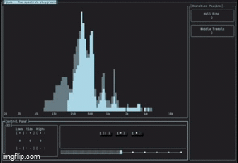

# FQLab

Spectral audio sandbox with custom plugin support

Created as part of the courses **NPRG035: Programming in C#** and **NPRG038: Advanced C# Programming** at Charles University.

    

## Before you install 

The app is currently Windows-only and requires a modern terminal (e.g. Windows Terminal).

The terminal's default font also has to support a broad scale of unicode characters in order for the terminal GUI to display properly.

Tested to work on: `JetBrains Mono Regular`

## Running the app

Clone the repo and use dotnet build + run in the FQLab project directory.

Information on how to navigate and use the app to its full potential can be found here: [User Manual](docs/user_manual.md)

## Plugin development

As mentioned before the app allows for custom audio plugin creation.

More information on how to create your own plugin here: [Creating a plugin](docs/plugin_creation.md)

### Further reading

[Project specification (CZ)](docs/specifikace_CZ.md)

[Full developer documentation](https://darilin98.github.io/FQLab/index.html)
