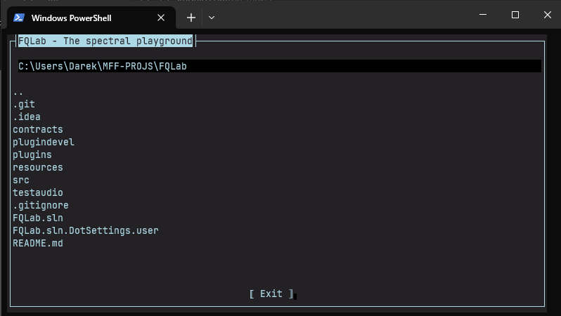

# User Guide

Once you manage to start the app you will be greeted by a file browser.

### File Browser

At the top text field you can see the directory you are located in.

Simply use your mouse to navigate directories:

    - Click the ".." icon at the top of the directory to go up
    - Double click a directory to go inside

No need to worry about clicking the wrong file, when you select an invalid file you will get a quick error message after which you can continue.

Once you select a valid audio file (eg. **.mp3** or **.wav**) the window will change into *play mode*.

### Play mode

The terminal is now split into 3 distinct parts.

1. `Graph View`
    - The largest of the windows, displays a live frequency decomposition graph. 
    - Pay attention to the legend at the bottom. There you can tell what frequency ranges are present the most at the moment.

2. `Control Panel`
    - Sits under the graph. Offers various options to control the audio playback.
    - It features an *Equalizer*. Use +/- buttons to increase or decrease individual ranges.
    - Use pause/play to control the track or hit stop to abort playback and return to file select.
    - The slider under the above mentioned three buttons is used to *change volume*.

3. `Plugin List`
    - The right side bar features a stack of all the detected plugins (if any).
    - Press the buttons on them to turn them on/off.
    - You can mix and match them however you like.

When playback is finished you automatically return to the file select.

Press `Exit` to quit the app.
